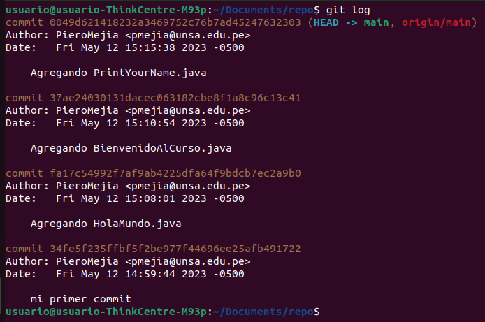

<!-- Template de cabecera -->

<table>
    <theader>
        <tr>
            <td>
                
            </td>
            <th>
                UNIVERSIDAD NACIONAL DE SAN AGUSTIN 
                FACULTAD DE INGENIERÍA DE PRODUCCIÓN Y SERVICIOS 
                DEPARTAMENTO ACADÉMICO DE INGENIERÍA DE SISTEMAS E INFORMÁTICA 
                ESCUELA PROFESIONAL DE INGENIERÍA DE SISTEMAS
            </th>
            <td>
                
            </td>
        </tr>
    </theader>
    <tbody>
        <tr>
            <td colspan="3">
                Formato
                : Guía de Práctica de Laboratorio / Talleres / Centros de Simulación
            </td>
        </tr>
        <tr>
            <td>
                Aprobación
                :  2022/03/01
            </td>
            <td>
                Código
                : GUIA-PRLE-001
            </td>
            <td>
                Página
                : 1
            </td>
        </tr>
    </tbody>
</table>

<!-- Información de laboratorio actual -->

    INFORME DE LABORATORIO 

<table>
    <theader>
        <tr>
            <th colspan="6">INFORMACIÓN BÁSICA</th>
        </tr>
    </theader>
    <tbody>
        <tr>
            <td>ASIGNATURA:</td>
            <td colspan="5">Programación Web 2</td>
        </tr>
        <tr>
            <td>TÍTULO DE LA PRÁCTICA:</td>
            <!-- Campo editable -->
            <td colspan="5">Vim - Git - GitHub</td>
        </tr>
        <tr>
            <td>NÚMERO DE PRÁCTICA:</td>
            <!-- Campo editable -->
            <td>01</td>
            <td>AÑO LECTIVO:</td>
            <!-- Campo editable -->
            <td>2023 A</td>
            <td>NRO. SEMESTRE:</td>
            <td>III</td>
        </tr>
        <tr>
            <td>FECHA DE PRESENTACIÓN::</td>
            <!-- Campo editable -->
            <td>  </td>
            <td>HORA DE PRESENTACIÓN:</td>
            <!-- Campo editable -->
            <td>  </td>
        </tr>
        <tr>
            <td colspan="6">INTEGRANTES:
                <!-- Campo editable -->
                <ul>
                    <!-- Aquí los integrantes del grupo -->
                    <li>Condori Pinto Juan José</li>
                    <li>Flores Sucapuca Ervin</li>
                    <li>Muñoz Romani Aroldo Guillermo</li>
                    <li>Mejia Ramos Piero Douglas</li>
                    <li>Vizcarra Gallegos Elias Eduardo</li>
                </ul>
            </td>
        </tr>
        <tr>
            <td colspan="6">DOCENTES:
                <ul>
                    <li> Anibal Sardón </li>
                </ul>
            </td>
        </tr>
    </tdbody>
</table>

<!-- Campo editable (título de práctica) -->
# Vim - Git - GitHub

[![License][license]][license-file]
[![Downloads][downloads]][releases]
[![Last Commit][last-commit]][releases]

[![Debian][Debian]][debian-site]
[![Git][Git]][git-site]
[![GitHub][GitHub]][github-site]
[![Vim][Vim]][vim-site]
[![Java][Java]][java-site]

#

## OBJETIVOS TEMAS Y COMPETENCIAS

### OBJETIVOS
<!-- Campo editable -->
- Conocer el editor de texto Vim.
- Aprender a manejar el sistema de control de versiones Git y utilizar GitHub para trabajar de manera colaborativa.

### TEMAS
<!-- Campo editable -->
- Editor Vim
- Java
- Git
- GitHub

COMPETENCIAS

<!-- Campo editable -->
- C.c Diseña responsablemente sistemas, componentes o procesos para satisfacer necesidades dentro de restricciones realistas: económicas, medio ambientales, sociales, políticas, éticas, de salud, de seguridad, manufacturación y sostenibilidad.
- C.m Construye responsablemente soluciones siguiendo un proceso adecuado llevando a cabo las pruebas ajustada a los recursos disponibles del cliente.
- C.p Aplica de forma flexible técnicas, métodos, principios, normas, estándares y herramientas de ingeniería necesarias para la construcción de software e implementación de sistemas de información.

## SOLUCIÓN Y RESULTADOS

#

### SOLUCIÓN DE EJERCICIOS/PROBLEMAS
-Link repositorio proyecto personal: https://github.com/EliasVizG/PWeb2LabB

(Algunos commits aparecen realizados por otra persona debido a que otro usuario estaba registrado en el ordenador al momento del commit, pero esto fue corregido al final).

-Link repositorio proyecto personal: https://github.com/ifs570/Pweb2LabB.git

-Link repositorio proyecto personal: https://github.com/pieroMejiaR/PWeb2-lab/tree/main/lab01

<!-- Aquí los ejercicios propuestos (grupales) -->
Se creo un repositorio grupal para desarrollar una calculadora con 5 metedos: add(), sub(), mul(), div() y mod().
Cada uno de estos metodos se desarrolló desde una rama diferente y se fue uniendo a la rama main 
Link repositorio grupal: https://github.com/jcondoripin/repo_pweb2_lab1

#

## CUESTIONARIO
<!-- Aquí las preguntas del cuestionario -->
- ¿Por qué Git y GitHub son herramientas importantes para el curso?

    -Porque ayudan a organizar y alojar archivos, esto es un desarrollo grupal es de gran ayuda

- ¿Qué conductas éticas deberían promocionarse cuando se usa un Sistema de Control de Versiones?

    -La responsabilidad, integridad y confindencialidad son algunas éticas que deben estar presentes al trabajar con este sistema ya que es un trabajo de equipo

- ¿Qué son los entándares de codificación?

    -Son un conjunto de "reglas" que no estan escritas pero que se han ido surgiendo en los desarrolladores para mejorar la calidad de código y los resultados

#

## CONCLUSIONES
<!-- Aquí las preguntas del cuestionario -->
    -GitHub es una herramienta que te da acceso a la gestion del codigo asi como ayuda a otras personas a ver tu código y aprender de el, teniendo esa sensacion
    de trabajo en codigo abierto ya que todo es visible y manipulable.

## REFERENCIAS
<!-- Campo editable -->
- https://git-scm.com/book/es/v2
- https://guides.github.com/
- https://www.w3schools.com/java/default.asp

- Nano vs. Emacs vs. Vim (Editor Wars!) - https://www.linuxtrainingacademy.com/nano-emacs-vim/
- Emacs vs Vim - https://www.linuxteaching.com/article/emacs_vs_vim
- Vim or Emacs? The Debate is over… - https://cmd.com/blog/vim-or-emacs-the-debate-is-over/
- Por qué un editor de texto de hace 40 años machaca al "todopoderoso" Atom - https://www.xataka.com/aplicaciones/por-que-un-editor-de-texto-de-hace-40-anos-le-da-sopas-con-ondas-al-todopoderoso-atom

- Tutorial de Vim - http://www.truth.sk/vim/vimbook-OPL.pdf
- Teclado en Vim - http://www.viemu.com/vi-vim-cheat-sheet.gif
- Cómo Configurar VIM como VS Code - https://www.youtube.com/watch?v=XgQFzi3VkC8

- Empezando el Curso de Java - https://www.youtube.com/playlist?list=PLw8RQJQ8K1yQDqPyDRzt-h8YlBj96OwMP
- The Java® Language Specification Java SE 11 Edition - https://docs.oracle.com/javase/specs/jls/se11/html/index.html
- The Java™ Tutorials - https://docs.oracle.com/javase/tutorial/
- Java Course - http://www.vias.org/javacourse/wrapnt4F38D8_object_oriented_programming.html

#

[license]: https://img.shields.io/github/license/rescobedoq/pw2?label=rescobedoq
[license-file]: https://github.com/rescobedoq/pw2/blob/main/LICENSE
[downloads]: https://img.shields.io/github/downloads/rescobedoq/pw2/total?label=Downloads
[releases]: https://github.com/rescobedoq/pw2/releases/
[last-commit]: https://img.shields.io/github/last-commit/rescobedoq/pw2?label=Last%20Commit
[Debian]: https://img.shields.io/badge/Debian-D70A53?style=for-the-badge&logo=debian&logoColor=white
[debian-site]: https://www.debian.org/index.es.html
[Git]: https://img.shields.io/badge/git-%23F05033.svg?style=for-the-badge&logo=git&logoColor=white
[git-site]: https://git-scm.com/
[GitHub]: https://img.shields.io/badge/github-%23121011.svg?style=for-the-badge&logo=github&logoColor=white
[github-site]: https://github.com/
[Vim]: https://img.shields.io/badge/VIM-%2311AB00.svg?style=for-the-badge&logo=vim&logoColor=white
[vim-site]: https://www.vim.org/
[Java]: https://img.shields.io/badge/java-%23ED8B00.svg?style=for-the-badge&logo=java&logoColor=white
[java-site]: https://docs.oracle.com/javase/tutorial/

[![Debian][Debian]][debian-site]
[![Git][Git]][git-site]
[![GitHub][GitHub]][github-site]
[![Vim][Vim]][vim-site]
[![Java][Java]][java-site]

[![License][license]][license-file]
[![Downloads][downloads]][releases]
[![Last Commit][last-commit]][releases]
